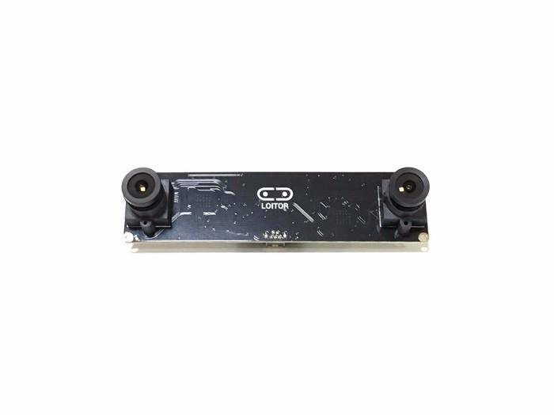
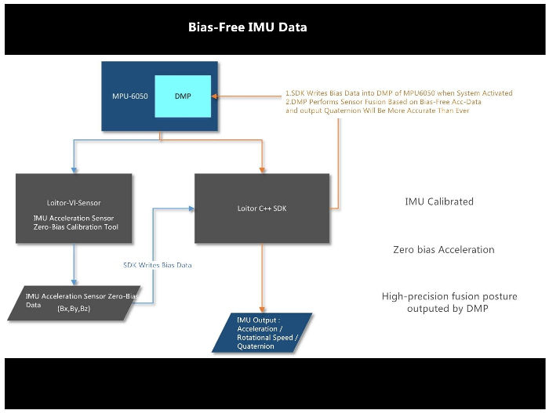

# vi_sensor_sdk
Loitor VI Sensor SDK, ROS pack and IMU calibration program.

###  Description

This package is used to run loitor camera module, which is a stereo camera which provides reliable images and inertial data.

##### Features 

* IMU zero bias calibration program.

* Zero bias initialization algorithm of DMP.
* High precision 6-DOF data.
* Minimum attitude drift.
* Stable and reliable ROS driver
* Ubuntu 16.04 and 14.04 supported

##### ROS Dependencies

- cv_bridge
- image_transport
- opencv2
- roscpp
- rospy
- sensor_msgs
- std_msgs

### Build

` mkdir -p camera_ws/src `

` cd camera_ws/src `

` git clone https://github.com/Pravin854/vi_sensor_sdk.git `

` cd ..`

` catkin_make`

### To run the code

`source devel/setup.bash`

` cd src/vi_sensor_sdk/loitor_ros_workspace/src/loitor_stereo_visensor `

` rosrun loitor_stereo_visensor loitor_stereo_visensor Loitor_VISensor_Setups.txt `

